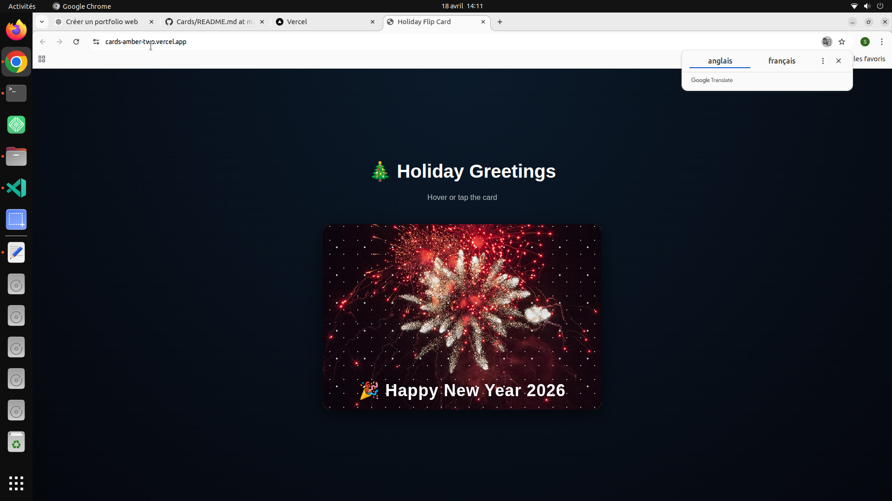

# 🎴 Cards

 HEAD
Interactive 3D holiday flip card with animations and effects.

## 🔗 Live Demo
https://cards-amber-two.vercel.app
A festive interactive flip card project inspired by Christmas and New Year themes.

---
 8710e86 (docs: unify README structure (cards))

## 🔗 Live Demo
https://cards-amber-two.vercel.app

## 📂 GitHub Repository
https://github.com/saidhadjadj/Cards

---

## 🌍 Overview
Cards is a simple but visually engaging flip card animation project featuring Christmas and New Year themed visuals with smooth transitions and interactive effects.

---

## ✨ Features
- 🎴 Flip card animation
- 🎄 Christmas / New Year theme
- ✨ Smooth CSS transitions
- 📱 Fully responsive design
- 🎨 Clean interactive UI

---

## 📸 Preview

---

## 🛠️ Tech Stack
- HTML5
- CSS3 (animations, 3D transforms)
- JavaScript (ES6)

---

## 🎯 Purpose
This project explores CSS animations, interactive UI design, and front-end transitions.

---

## 👤 Author
Said Hadjadj
